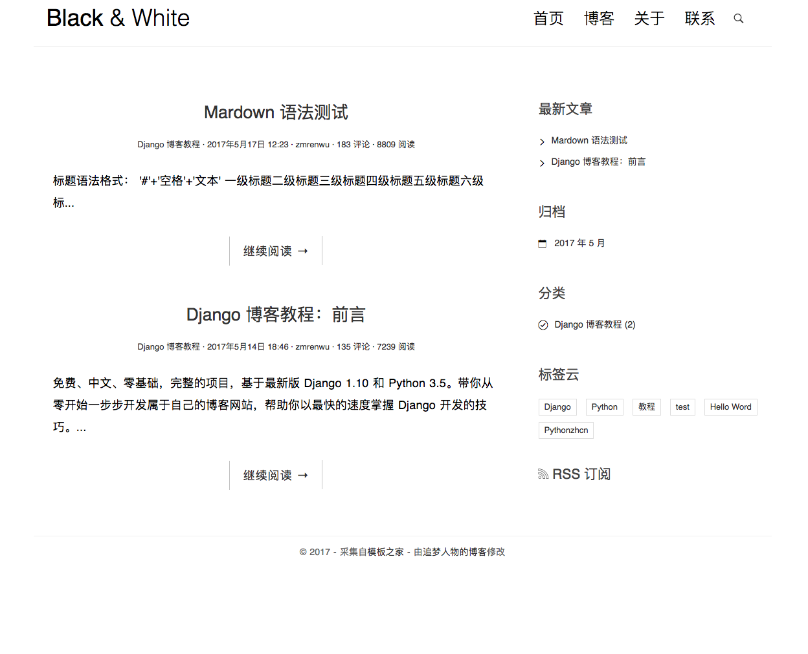

# django-blog
使用Django搭建一个简单博客

**这里是做完后的样子：**



使用下列环境：
- python 3.6.4
- django 2.0.2

### 基本操作

```shell
$ django-admin startproject mysite
$ python manage.py runserver
$ python manage.py startapp polls
```
### View

```python
from django.http import HttpResponse, Http404
from .models import Question
from django.template import loader

def index(request):
    latest_question_list = Question.objects.order_by('-pub_date')[:5]
    template = loader.get_template('polls/index.html')
    context = {
        'latest_question_list': latest_question_list,
    }
    return HttpResponse(template.render(context, request))
```

```python
from django.shortcuts import render

from .models import Question


def index(request):
    latest_question_list = Question.objects.order_by('-pub_date')[:5]
    context = {'latest_question_list': latest_question_list}
    return render(request, 'polls/index.html', context)
```
    

### Routing

```python
# mysite/urls.py
from django.urls import include, path
from django.contrib import admin

urlpatterns = [
    path('polls/', include('polls.urls')),
    path('admin/', admin.site.urls),
]
```

```python
# polls/urls.py
from django.urls import path

from . import views

urlpatterns = [
    path('', views.index, name='index'),
]
```

### Model
```python
from django.db import models

class Question(models.Model):
    question_text = models.CharField(max_length=200)
    pub_date = models.DateTimeField('dat published')

class Choice(models.Model):
    question = models.ForeignKey(Question, on_delete=models.CASCADE)
    choice_text = models.CharField(max_length=200)
    votes = models.IntegerField(default=0)
```

### Database Migration
```
python manage.py makemigrations polls
python manage.py sqlmigrate polls 0001 # No use, give sql
python manage.py migrate
python manage.py shell # Play with db api
```

### Database API
```python
>>> from polls.models import Question, Choice   # Import the model classes we just wrote.
>>> from django.utils import timezone
>>> q = Question(question_text="What's new?", pub_date=timezone.now())
>>> q.save()
>>> q.id
>>> Question.objects.all()
<QuerySet [<Question: Question object (1)>]>
>>> Question.objects.filter(question_text__startswith='What')
```

### Admin
```
$ python manage.py createsuperuser
```

To include in admin panel:
```python
# polls/admin.py
from django.contrib import admin

from .models import Question

admin.site.register(Question)
```
